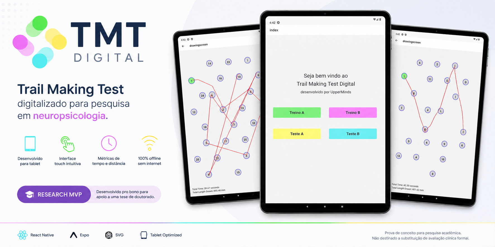
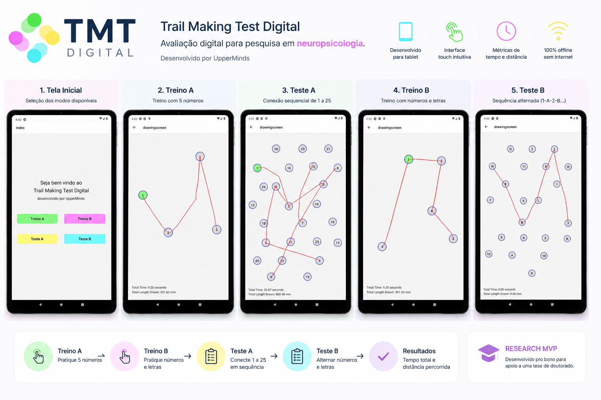

<p align="center">
  
</p>

<p align="center">


</p>

# 🧠 TMT Digital

### Digital adaptation of the Trail Making Test for neuropsychological research.

TMT Digital is a tablet-first application developed to digitalize the **Trail Making Test (TMT)**, a widely used neuropsychological assessment that evaluates visual attention, processing speed and cognitive flexibility.

The application was developed **pro bono** for a Ph.D. research project, replacing the traditional paper-based workflow with an intuitive touch interface.

> **Turning a clinical protocol into a digital experience.**

---

# 🎯 The Challenge

The traditional Trail Making Test is performed using printed sheets and manual timing.

Researchers needed a digital solution capable of:

- Running both Part A and Part B
- Supporting training sessions
- Recording drawing paths
- Measuring completion time
- Measuring drawing distance
- Providing an intuitive touch experience on tablets

The goal was to simplify research sessions while preserving the original testing methodology.

---

# 👨‍💻 My Role

I participated in the complete product development, transforming a neuropsychological protocol into a functional mobile application.

Responsibilities included:

- Requirements Analysis
- UX Design
- Application Architecture
- React Native Development
- SVG Drawing Engine
- Touch Interaction
- Navigation Flow
- Screen Design
- Performance Optimization
- Tablet Experience
- Research Validation Support

---

# 📱 Screenshots

<p align="center">
  
</p>

---

# ✨ Core Features

| Feature | Description |
|----------|-------------|
| 🧠 Trail Making Test A | Sequential number connection |
| 🔠 Trail Making Test B | Alternating numbers and letters |
| 🎯 Training Mode | Practice before official assessment |
| ✍️ Freehand Drawing | Real-time touch path rendering |
| ⏱ Time Measurement | Completion time tracking |
| 📏 Drawing Distance | Total path length calculation |
| 📱 Tablet Optimized | Designed for large touch screens |
| ⚡ Offline Operation | No internet connection required |

---

# 🏗 Architecture

```text
React Native (Expo)
        │
        ▼
React Navigation
        │
        ▼
Drawing Engine (SVG)
        │
        ▼
Touch Events
        │
        ▼
Time & Distance Metrics
        │
        ▼
Assessment Results
```

---

# 📊 Technical Highlights

- Touch-first interface
- React Native SVG rendering
- Tablet-optimized layout
- Offline operation
- Lightweight architecture
- Native performance
- Custom drawing engine
- Real-time path rendering
- Simple navigation flow
- Research-focused UX

---

# ⚙ Tech Stack

## Frontend

- React Native
- Expo
- JavaScript
- React Navigation
- React Native SVG

## Mobile

- Expo Screen Orientation
- Safe Area Context
- Gesture Handling

---

# 🚀 Technical Challenges

## Drawing Engine

Implementing a smooth SVG-based drawing system capable of accurately following the user's finger movement.

---

## Performance

Rendering dozens of touch points in real time while maintaining a fluid experience on tablets.

---

## Clinical Workflow

Transforming a paper-based neuropsychological assessment into an intuitive digital workflow without increasing cognitive load.

---

## Tablet Experience

Designing layouts optimized for large touch screens instead of traditional smartphones.

---

# 🧠 Domain Knowledge

Unlike a generic drawing application, this project required understanding the Trail Making Test methodology.

The application supports:

- Part A assessment
- Part B assessment
- Training sessions
- Touch interaction
- Visual path rendering
- Completion time
- Drawing distance

The focus was not only software development, but accurately translating a clinical assessment into a digital experience.

---

# 📈 Why this project stands out

✅ Real client project

✅ Healthcare / Research domain

✅ Digitalization of a clinical protocol

✅ Tablet-first UX

✅ Custom SVG drawing engine

✅ Offline application

✅ Cross-platform architecture

✅ Research-oriented design

---

# 📚 What I Learned

This project demonstrated how software can support scientific research by improving usability without changing established methodologies.

It reinforced the importance of understanding the user's domain before writing code.

Working with researchers required translating technical concepts into practical workflows while respecting the original clinical protocol.

---

# 🔬 Project Context

This application was developed as a **pro bono project** to support a Ph.D. research initiative.

Its purpose was to digitalize the Trail Making Test workflow for academic research.

Although functional, it was never intended to replace certified clinical assessment software.

---

# 🔗 Repository Purpose

This repository is a **case study** showcasing the product architecture, UX decisions and implementation behind TMT Digital.

The production source code remains private.

---

## ⭐ Building technology that supports science.
